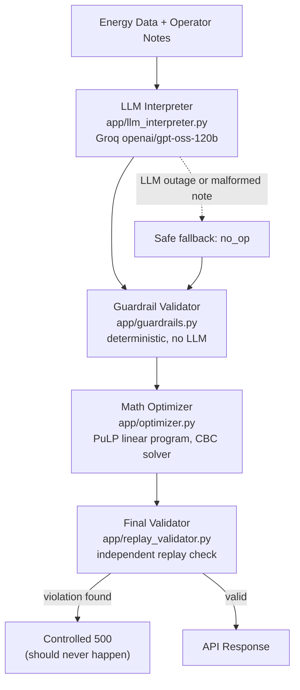

# GridWise LLM: BUP CSE Fest 2026 Hackathon (Preliminary)

LLM-assisted operator-directive interpretation and 24-hour campus energy cost optimization.
Implements the full pipeline required by the Problem Statement.

## System architecture



Human notes are never trusted directly as math. They pass through the LLM interpreter, then a
deterministic guardrail layer, before anything reaches the optimizer. The final validator then
independently re-checks the optimizer's own output before it is returned.

## Architecture and implementation choices

- **Language/framework:** Python 3.12, FastAPI + Uvicorn.
- **LLM:** Groq-hosted `openai/gpt-oss-120b` (configurable via `GROQ_MODEL`), called through the official `groq` Python SDK using JSON-mode structured output. The LLM is the only component that interprets `operator_notes` free text. It is mandatory on the request path per the Problem Statement, never used only for `plan_summary`.
- **Guardrails:** Pure deterministic Python (`app/guardrails.py`). Every field of the LLM's JSON output is validated against the exact shape required for its `directive_type` (Problem Statement Section 04/08) before anything reaches the optimizer. The LLM is never trusted directly.
- **Optimizer:** A true linear program built with [PuLP](https://coin-or.github.io/pulp/) and solved with the bundled CBC solver, not a heuristic, so cost is genuinely minimal subject to all GridWise energy/battery rules and every applicable directive (Problem Statement Section 05.2/09). This directly targets the Optimization Quality score, which is `min(1, organizer_optimal_cost / recalculated_team_cost)`.
- **Final validator:** `app/replay_validator.py` independently re-derives energy balance, battery bounds/rate limits, every directive constraint, and the reported totals from the *optimizer's own output*, with no shared code path to the optimizer. If it ever disagrees, the service returns a controlled 500 instead of a plan that might violate a constraint. This is defense in depth against an optimizer bug.

## Safe-failure design (Problem Statement Section 08 "SAFE FAILURE")

- If the Groq call fails entirely (timeout, outage, invalid credentials) after one retry, the service does **not** crash or invent a directive. Every operator note for that request is deterministically downgraded to `no_op`, and a valid, cost-optimal (unconstrained) 24-hour schedule is still returned with HTTP 200.
- If the LLM returns JSON but a specific note's entry is malformed, missing, has an unsupported `directive_type`, or has an out-of-range/wrong-shaped `structured_adjustment` (e.g. a reserve above battery capacity, a `factor` outside `[0,1]`, an hour outside `0-23`), **only that note** falls back to `no_op`. Other, validly-interpreted notes in the same request are still applied normally.
- This is a deliberate trade-off: a wrong *invented* directive risks failing Directive Application & Constraint Correctness (25 pts) and the Critical Violations rules, while a safe `no_op` only loses partial interpretation credit for the one affected note. See `app/guardrails.py` module docstring for the full rationale.
- Malformed/structurally invalid request JSON returns HTTP 400 (not the FastAPI default of 422; overridden in `app/main.py` to match the Problem Statement's API contract exactly).
- Any unexpected internal error returns HTTP 500 with a generic `{"detail": "internal error"}` body. Stack traces and secrets are never included in logs sent to stdout in a way that reaches the response, per the Participant Guide's secret-handling requirement.

## Setup

### Requirements
- Python 3.12+ (only 3.12 has been tested; 3.11+ should work)
- A [Groq](https://console.groq.com/keys) API key

### Environment variables

Copy `.env.example` to `.env` and fill in your own key locally. **Never commit `.env`.**

| Variable | Required | Default | Purpose |
|---|---|---|---|
| `GROQ_API_KEY` | yes | none | Groq API key used for operator-note interpretation |
| `GROQ_MODEL` | no | `openai/gpt-oss-120b` | Groq model id |
| `LLM_TIMEOUT_SECONDS` | no | `10` | Per-call Groq client timeout |
| `REQUEST_TIMEOUT_SECONDS` | no | `25` | Hard ceiling for the whole `/optimize-energy` request |
| `PORT` | no | `8000` | Port the service listens on |

### Local quickstart (clean environment)

```bash
git clone <this repo>
cd <this repo>
python -m venv .venv
# Windows (Git Bash):
source .venv/Scripts/activate
# macOS/Linux:
# source .venv/bin/activate

pip install -r requirements.txt
cp .env.example .env   # then edit .env and set GROQ_API_KEY

uvicorn app.main:app --host 0.0.0.0 --port 8000
```

In another terminal:

```bash
curl http://localhost:8000/health
# {"status":"ok"}
```

For a real sample request, extract one case's `input` object from the public sample pack, e.g.:

```bash
python -c "
import json
cases = json.load(open('Problem Statement/BUP_CSE_FEST_2026_Preli_Public_Sample_Cases.json'))['cases']
json.dump(next(c for c in cases if c['id']=='SAMPLE-02')['input'], open('sample_request.json','w'))
"
curl -X POST http://localhost:8000/optimize-energy \
  -H "Content-Type: application/json" \
  --data @sample_request.json
```

### Running tests

```bash
pip install -r requirements.txt   # includes pytest
pytest                            # runs guardrail/optimizer/API-contract tests (no network needed)
GROQ_API_KEY=your_key pytest tests/test_public_samples.py   # live end-to-end check against all 10 public cases
```

- `tests/test_guardrails.py`, `tests/test_optimizer.py`: pure unit tests, no network, no API key required.
- `tests/test_api_contract.py`: schema/status-code tests against the FastAPI app with the LLM call monkeypatched out (no network required).
- `tests/test_public_samples.py`: end-to-end against the real Groq API and all 10 public sample cases. **Automatically skipped** if `GROQ_API_KEY` is not set (e.g. in CI). Run it locally with a real key before submitting. It does not byte-for-byte compare against the packaged reference numbers (per the sample pack's own instructions); it checks self-consistency of the returned plan, directive-interpretation semantics against ground truth within tolerance, and that the reported cost does not exceed an independently-recomputed optimum for the ground-truth directives.

Confirmed passing against the live Groq API during development, including two cases (SAMPLE-09, SAMPLE-10) checked manually over real HTTP and via the built Docker image, both returning `total_grid_kwh`/`total_cost_bdt`/`peak_grid_kwh` identical to the packaged reference values, with request latency around 1.5-2.5s (well within the top p95 scoring tier).

## Docker fallback image

```bash
docker build -t gridwise-llm .
docker run --rm -p 8000:8000 --env-file .env gridwise-llm
curl http://localhost:8000/health
```

The image exposes port 8000, binds `0.0.0.0`, and contains no baked-in secrets. All configuration is supplied at `docker run` time via `--env-file` or `-e`. Verified end-to-end locally: `docker build` succeeds, the container serves `/health` and correctly-computed `/optimize-energy` responses (confirmed against public sample cases with exact-match totals), and its filesystem contains no `.env`/secret files (`.dockerignore` excludes `.venv/`, `.env*`, tests, and the Problem Statement PDFs from the build context).

## Deploying publicly

Deploy the `Dockerfile` as-is to any reachable host (Render, Railway, Fly.io, a VPS, etc.), no code changes needed. In short:

1. Create a GitHub repo **after** question reveal, push this code, keep it **private** during the event, make it **public** only after the submission deadline (Participant Guide repo policy). Confirm `.env` is not in the pushed repo.
2. Point your host at the repo/Dockerfile and set `GROQ_API_KEY`, `GROQ_MODEL`, `LLM_TIMEOUT_SECONDS`, `REQUEST_TIMEOUT_SECONDS` as environment variables in the host's dashboard. Never commit them.
3. Set the host's health check path to `/health` if it supports one.
4. Verify both endpoints from outside your network once deployed (`curl <base-url>/health`, then a `POST /optimize-energy` with a public sample case).
5. If using a scale-to-zero free tier, be aware a request after 15+ minutes idle can cold-start slowly. `.github/workflows/keep-warm.yml` pings `/health` every 10 minutes to prevent this; enable it (or use an always-on paid tier) before judging starts.

## Dependencies

See `requirements.txt`:
- `fastapi`, `uvicorn[standard]`: HTTP service
- `pydantic`: request/response schema validation
- `pulp`: linear programming optimizer (bundled CBC solver, no external binary install needed)
- `groq`: official Groq SDK for LLM calls
- `python-dotenv`: loads `.env` for local development
- `httpx`, `pytest`: test tooling

## Known limitations

- The Groq API is a hosted, third-party dependency. If it is unreachable or misconfigured (missing/invalid `GROQ_API_KEY`), the service still responds correctly (HTTP 200) but treats every operator note as `no_op`, per the safe-failure design above. It cannot apply directives it was never able to interpret.
- The guardrail's safe-fallback-to-`no_op` policy for a single malformed note (see "Safe-failure design" above) means a note that *should* have mapped to a real directive, but whose LLM output failed shape/range validation, is scored as an interpretation miss for that note rather than retried indefinitely. This keeps latency and reliability within the Participant Guide's p95/timeout budget.
- Request numeric fields (`demand_kwh`, `tariff_bdt_per_kwh`, battery values, etc.) explicitly reject `Infinity`/`NaN` (`allow_inf_nan=False`) in addition to non-negativity, since Python's `json` module accepts those non-standard literals by default and a plain `>= 0` constraint alone would let `Infinity` through undetected.
- If a scale-to-zero free host tier is used for deployment, a request landing after 15+ minutes of inactivity can cold-start slowly. See "Deploying publicly" above for a mitigation.
- No authentication/rate limiting is implemented, per the Problem Statement's requirement that judging needs no login/VPN/dashboard access.
