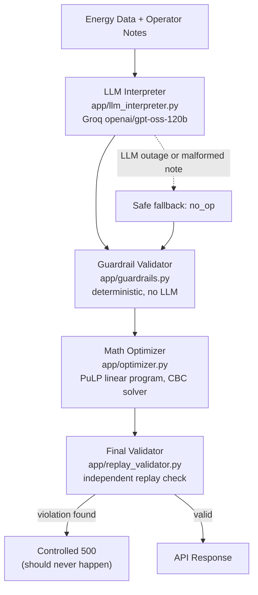

# GridWise LLM: BUP CSE Fest 2026 Hackathon (Preliminary)

LLM assisted operator directive interpretation and 24 hour campus energy cost optimization.
Implements the pipeline required by the Problem Statement.

## System architecture



Human notes are never trusted directly as math. They pass through the LLM interpreter, then a
deterministic guardrail layer, before anything reaches the optimizer. The final validator then
independently rechecks the optimizer's own output before it is returned.

## Implementation choices

- **Language and framework:** Python 3.12, FastAPI and Uvicorn.
- **LLM:** Groq hosted `openai/gpt-oss-120b` (configurable via `GROQ_MODEL`), called through the official `groq` Python SDK using JSON mode structured output. The LLM is the only component that interprets `operator_notes` free text. It is mandatory on the request path per the Problem Statement, never used only for `plan_summary`.
- **Guardrails:** Pure deterministic Python (`app/guardrails.py`). Every field of the LLM's JSON output is validated against the exact shape required for its `directive_type` (Problem Statement Section 04/08) before anything reaches the optimizer. The LLM is never trusted directly.
- **Optimizer:** A true linear program built with [PuLP](https://coin-or.github.io/pulp/) and solved with the bundled CBC solver, not a heuristic, so cost is genuinely minimal subject to all GridWise energy and battery rules and every applicable directive (Problem Statement Section 05.2/09). This targets the Optimization Quality score, which is `min(1, organizer_optimal_cost / recalculated_team_cost)`.
- **Final validator:** `app/replay_validator.py` independently rederives energy balance, battery bounds and rate limits, every directive constraint, and the reported totals from the optimizer's own output, with no shared code path to the optimizer. If it ever disagrees, the service returns a controlled 500 instead of a plan that might violate a constraint.

## Safe failure design (Problem Statement Section 08)

- If the Groq call fails entirely (timeout, outage, invalid credentials) after one retry, the service does not crash or invent a directive. Every operator note for that request is deterministically downgraded to `no_op`, and a valid, cost optimal (unconstrained) 24 hour schedule is still returned with HTTP 200.
- If the LLM returns JSON but a specific note's entry is malformed, missing, has an unsupported `directive_type`, or has an out of range or wrong shaped `structured_adjustment` (for example a reserve above battery capacity, a `factor` outside `[0,1]`, an hour outside `0 through 23`), only that note falls back to `no_op`. Other, validly interpreted notes in the same request still apply.
- A wrong invented directive risks failing Directive Application & Constraint Correctness (25 pts) and the Critical Violations rules, while a safe `no_op` only loses partial interpretation credit for the one affected note. See the `app/guardrails.py` module docstring for the full rationale.
- Malformed or structurally invalid request JSON returns HTTP 400 (the Problem Statement's contract; overridden in `app/main.py` from FastAPI's default of 422).
- Any unexpected internal error returns HTTP 500 with a generic `{"detail": "internal error"}` body. Stack traces and secrets are never included in a response.

## Setup

### Requirements
- Python 3.12 or newer (3.12 is the version tested; 3.11 should also work)
- A [Groq](https://console.groq.com/keys) API key

### Environment variables

Copy `.env.example` to `.env` and fill in your own key locally. Never commit `.env`.

| Variable | Required | Default | Purpose |
|---|---|---|---|
| `GROQ_API_KEY` | yes | none | Groq API key used for operator note interpretation |
| `GROQ_MODEL` | no | `openai/gpt-oss-120b` | Groq model id |
| `LLM_TIMEOUT_SECONDS` | no | `10` | Per call Groq client timeout |
| `REQUEST_TIMEOUT_SECONDS` | no | `25` | Hard ceiling for the whole `/optimize-energy` request |
| `PORT` | no | `8000` | Port the service listens on |

### Local quickstart

```bash
git clone https://github.com/TanvirMahmudTushar/gridwise-llm-bup-cse-fest-2026.git
cd gridwise-llm-bup-cse-fest-2026
python -m venv .venv
source .venv/Scripts/activate   # Windows Git Bash
# source .venv/bin/activate     # macOS/Linux

pip install -r requirements.txt
cp .env.example .env   # then edit .env and set GROQ_API_KEY

uvicorn app.main:app --host 0.0.0.0 --port 8000
```

In another terminal:

```bash
curl http://localhost:8000/health
# {"status":"ok"}
```

For a real sample request, extract one case's `input` object from the public sample pack:

```bash
python -c "
import json
cases = json.load(open('Problem Statement/BUP_CSE_FEST_2026_Preli_Public_Sample_Cases.json'))['cases']
json.dump(next(c for c in cases if c['id']=='SAMPLE-02')['input'], open('sample_request.json','w'))
"
curl -X POST http://localhost:8000/optimize-energy \
  -H "Content-Type: application/json" \
  --data @sample_request.json
```

### Running tests

```bash
pip install -r requirements.txt
pytest                                                          # guardrail, optimizer, and API contract tests, no network needed
GROQ_API_KEY=your_key pytest tests/test_public_samples.py       # live check against all 10 public cases
GROQ_API_KEY=your_key pytest tests/test_paraphrase_robustness.py  # live check with wording outside the public pack
```

- `tests/test_guardrails.py`, `tests/test_optimizer.py`: unit tests, no network or API key required.
- `tests/test_api_contract.py`: schema and status code tests with the LLM call replaced by a stub, no network required.
- `tests/test_public_samples.py`: end to end against the real Groq API and all 10 public sample cases. Skipped automatically if `GROQ_API_KEY` is not set. Does not compare byte for byte against the packaged reference numbers, per the sample pack's own instructions; it checks self consistency of the returned plan, directive interpretation semantics against ground truth within tolerance, and that the reported cost does not exceed an independently recomputed optimum for the ground truth directives.
- `tests/test_paraphrase_robustness.py`: end to end against the real Groq API using operator notes worded differently from the public pack (24 hour clock times, indirect phrasing, different units, a distractor not seen before), to guard against the prompt overfitting to the public wording. Also skipped automatically without `GROQ_API_KEY`.

## Docker fallback image

Pull the prebuilt, pushed image:

```bash
docker pull tanvirmahmud/gridwise-llm:v1
docker run --rm -p 8000:8000 \
  -e GROQ_API_KEY=your_groq_key \
  -e GROQ_MODEL=openai/gpt-oss-120b \
  tanvirmahmud/gridwise-llm:v1
curl http://localhost:8000/health
```

Exact digest: `tanvirmahmud/gridwise-llm@sha256:712fdfafe17b09aa8b143a4c627f6ed1b0f065e43404a5a0923ac0b8b0c26c36`

Or build it from source:

```bash
docker build -t gridwise-llm .
docker run --rm -p 8000:8000 --env-file .env gridwise-llm
curl http://localhost:8000/health
```

The image exposes port 8000, binds `0.0.0.0`, and contains no baked in secrets. Verified end to end: the pushed image was pulled fresh onto a clean machine and confirmed working against `/health` and a real `/optimize-energy` request, with totals matching the public sample pack exactly.

## Deploying publicly

Deploy the `Dockerfile` as is to any reachable host, no code changes needed.

1. Create a GitHub repository after question reveal, push this code, keep it private during the event, make it public only after the submission deadline (Participant Guide repository policy). Confirm `.env` is not in the pushed repository.
2. Point the host at the repository or Dockerfile and set `GROQ_API_KEY`, `GROQ_MODEL`, `LLM_TIMEOUT_SECONDS`, `REQUEST_TIMEOUT_SECONDS` as environment variables in the host's dashboard. Never commit them.
3. Set the host's health check path to `/health` if it supports one.
4. Verify both endpoints from outside your network once deployed.
5. If the host has a free tier that idles down after inactivity, the included `.github/workflows/keep-warm.yml` pings `/health` every 10 minutes to prevent that specific cold start. This does not address the separate concurrency limitation below; it only keeps a single idle instance from being unloaded.

## Dependencies

- `fastapi`, `uvicorn[standard]`: HTTP service
- `pydantic`: request and response schema validation
- `pulp`: linear programming optimizer, with the CBC solver bundled
- `groq`: official Groq SDK for LLM calls
- `python-dotenv`: loads `.env` for local development
- `httpx`, `pytest`: test tooling

## Known limitations

- The Groq API is a hosted, third party dependency. If it is unreachable or misconfigured, the service still responds correctly (HTTP 200) but treats every operator note as `no_op`, since it cannot apply a directive it was never able to interpret.
- A single malformed note falls back to `no_op` rather than being retried indefinitely, to keep latency and reliability within the Participant Guide's budget. This trades a small amount of interpretation credit on that one note for guaranteed availability.
- Request numeric fields explicitly reject `Infinity` and `NaN` in addition to non negative values, since Python's `json` module accepts those nonstandard literals by default and a plain `>= 0` check alone would not catch them.
- Under concurrent load, response latency was measured to be significantly worse than under sequential load on the current free tier host (roughly 1.5 to 2.5 seconds sequentially, versus a measured worst case above 20 seconds with 10 simultaneous requests). This was isolated to the host's own CPU allocation, not the application code or the Groq API: 10 concurrent calls fired directly at Groq, bypassing the app entirely, completed in a tight band with no degradation. If the judging harness sends requests with meaningful concurrency, this could cost latency tier points even though every request still completes correctly. An upgrade to a host tier with dedicated compute would remove this risk; it was not pursued further given the scope of the event.
- No authentication or rate limiting is implemented, since the Problem Statement requires judging without a login, VPN, or dashboard access.
